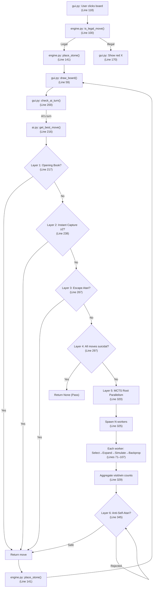

# Code Interview Pipeline — Full Execution Walkthrough

This document traces the **complete execution path** of the Go engine, from the moment you launch the app to when the AI returns a move. Every key step references exact file and line numbers.

---

## Phase 1: Application Startup

### Step 1 — Launch & Window Creation
> **File:** `gui.py` → [Lines 235–238](file:///c:/Users/crs02/go%20player/gui.py#L235-L238)

```python
if __name__ == "__main__":
    root = tk.Tk()
    app = GoGUI(root)
    root.mainloop()
```
Python's entry point creates a Tkinter root window, constructs a `GoGUI` instance, and starts the event loop.

### Step 2 — GUI Initialization & Engine/AI Construction
> **File:** `gui.py` → [Lines 7–57](file:///c:/Users/crs02/go%20player/gui.py#L7-L57)

Key objects created:
- **Line 13:** `self.engine = GoEngine(size)` — Creates the rules engine (9×9 board, superko set, captures, etc.)
- **Line 14:** `self.ai = GoAI(time_limit=5, iteration_cap=30000)` — Creates the AI with a 5-second clock and 30,000 iteration cap
- **Lines 24–28:** Game mode dropdown (`Human vs Human`, `AI plays White`, `AI plays Black`, `AI vs AI`)
- **Lines 31–38:** Pass, Undo, Reset buttons
- **Lines 52–55:** Canvas (board) creation and mouse click binding

### Step 3 — GoEngine Initialization
> **File:** `engine.py` → [Lines 1–15](file:///c:/Users/crs02/go%20player/engine.py#L1-L15)

```python
self.board = [[0 for _ in range(size)] for _ in range(size)]  # 9x9 grid of zeros
self.current_player = 1          # Black always plays first
self.history_set = set()         # Positional Superko — stores ALL past board states as tuples
self.captures = {1: 0, 2: 0}    # Capture counters for each player
self.final_scores = {1: 0, 2: 2.5}  # White gets 2.5 komi (first-move compensation)
self.state_stack = []            # Stack for undo functionality
```

### Step 4 — Board Rendering
> **File:** `gui.py` → [Lines 59–101](file:///c:/Users/crs02/go%20player/gui.py#L59-L101)

`draw_board()` runs every time the board state changes:
1. **Lines 63–69:** Draw 9 horizontal + 9 vertical grid lines
2. **Lines 72–77:** Draw 5 star points (hoshi) at the traditional positions
3. **Lines 85–98:** Loop through the board, draw black/white ovals for placed stones, highlight the last move in red
4. **Line 100:** `update_labels()` — refresh score/capture display
5. **Line 101:** `check_ai_turn()` — check if the AI should play next (critical trigger!)

---

## Phase 2: Human Makes a Move

### Step 5 — Click Detection
> **File:** `gui.py` → [Lines 118–145](file:///c:/Users/crs02/go%20player/gui.py#L118-L145)

1. **Lines 119–127:** Guard checks — ignore clicks if game is over or if it's the AI's turn
2. **Lines 130–131:** Convert pixel `(x, y)` click coordinates → board `(row, col)` using `round()` math
3. **Lines 136–140:** Proximity check — the click must be within 45% of cell size to the nearest intersection (prevents misclicks)
4. **Line 141:** Calls `engine.is_legal_move(r, c)` to validate the move

### Step 6 — Legal Move Validation
> **File:** `engine.py` → [Lines 100–139](file:///c:/Users/crs02/go%20player/engine.py#L100-L139)

This is the **core rules engine**. It runs 4 checks in sequence:

| Check | Lines | What it does |
|-------|-------|-------------|
| Bounds & Occupied | 101–108 | Is the game over? Is (r,c) in bounds? Is the spot already taken? |
| Capture Simulation | 110–124 | Clone the board, place the stone, then flood-fill all adjacent opponent groups. If any group has 0 liberties, remove it. |
| Suicide Rule | 126–132 | After removing captured opponents, flood-fill our OWN group. If we still have 0 liberties → illegal suicide. |
| Positional Superko | 134–137 | Hash the resulting board as a tuple. If that exact board state exists in `history_set` → illegal (prevents infinite loops). |

### Step 7 — Place Stone & Handle Captures
> **File:** `engine.py` → [Lines 141–168](file:///c:/Users/crs02/go%20player/engine.py#L141-L168)

1. **Line 146:** Push a snapshot of the entire current state onto `state_stack` (enables Undo)
2. **Line 150:** Write the stone onto the board: `self.board[r][c] = self.current_player`
3. **Lines 153–160:** Loop through adjacent opponent groups, flood-fill each one, remove any with 0 liberties
4. **Line 162:** Add the number of captured stones to the player's capture counter
5. **Line 163:** Hash the new board state into `history_set` (Superko protection for future moves)
6. **Line 167:** Switch turn: `self.current_player = self.get_opponent(self.current_player)`

### Key Algorithm — Flood Fill for Groups & Liberties
> **File:** `engine.py` → [Lines 76–98](file:///c:/Users/crs02/go%20player/engine.py#L76-L98)

### Simulation-Only Fast Variants
> **File:** `engine.py` → [Lines 141–199](file:///c:/Users/crs02/go%20player/engine.py#L141-L199)

Two lightweight methods exist solely for use inside MCTS rollouts — never for real game moves:

- **`is_legal_move_fast` (Lines 141–155):** Same as `is_legal_move` but skips the superko hash step (no `_board_to_tuple` call, no `history_set` lookup). Superko violations during random rollouts are statistically negligible, so paying the O(81) hash cost per legal move test is pure waste in simulation.
- **`_place_stone_sim` (Lines 186–199):** Same as `place_stone` but skips `state_stack.append(_create_snapshot())`. Since rollouts never need undo, the full board deep-copy that snapshot creates was being done up to 50× per rollout across millions of iterations. Returns the set of captured positions so the caller can update the incremental empty set.

```python
def _get_group_and_liberties(self, board, r, c):
```
Uses **Depth-First Search (DFS)** via `queue.pop()` (O(1) stack pop, not O(N) list shift):
- Starts at `(r, c)`, explores all connected same-color stones
- Returns two sets: `group` (all stones in the chain) and `liberties` (all empty spaces touching the chain)
- This function is called **millions of times** during MCTS simulations — the DFS optimization is critical for speed

---

## Phase 3: AI Turn Trigger

### Step 8 — Check If AI Should Play
> **File:** `gui.py` → [Lines 200–216](file:///c:/Users/crs02/go%20player/gui.py#L200-L216)

`check_ai_turn()` is called at the end of every `draw_board()`. It checks the game mode dropdown:
- If `AI plays White` and `current_player == 2` → AI plays
- If `AI plays Black` and `current_player == 1` → AI plays
- If `AI vs AI` → AI always plays

**Line 216:** `self.root.after(50, self.do_ai_turn)` — Schedules the AI move after a 50ms delay (gives Tkinter time to render)

### Step 9 — Execute AI Turn
> **File:** `gui.py` → [Lines 218–232](file:///c:/Users/crs02/go%20player/gui.py#L218-L232)

1. **Line 223:** Update the GUI to show "Thinking..." so the user knows the AI is working
2. **Line 224:** `self.root.update()` — Force-render the label before the AI blocks the thread
3. **Line 226:** `move = self.ai.get_best_move(self.engine)` — **This is the main AI entry point**
4. **Lines 227–230:** If the AI returns `None`, pass. Otherwise, place the stone.
5. **Line 232:** Redraw the board (which triggers `check_ai_turn()` again for AI vs AI mode)

---

## Phase 4: AI Decision Pipeline (`get_best_move`)

> **File:** `ai.py` → [Lines 216–366](file:///c:/Users/crs02/go%20player/ai.py#L216-L366)

The AI runs through **6 sequential decision layers**. Each layer can short-circuit and return a move immediately, skipping everything below it.

### Layer 1 — Opening Book
> **Lines 217–236**

```python
if empty_count >= (engine.size * engine.size) - 1:  # Only on the very first move
```
- Checks if the board has 80+ empty spaces (meaning it's the first move of the game)
- Randomly selects from **12 curated opening points**: the 4 star points (3-3) and their 3-4/4-3 Komoku variations
- **Why?** The first move in Go is well-studied. Playing near the 3-3 points is universally strong on 9×9. Skipping MCTS here saves 5 seconds.

### Layer 2 — Instant Capture Override
> **Lines 238–265**

- Scans every empty intersection on the board
- For each one, checks adjacent opponent stones using `_get_group_and_liberties()`
- If any opponent group has exactly **1 liberty** and the capture would kill **≥ 2 stones**: take it instantly
- **Line 263:** `if best_capture_move and max_capture_size >= 2` — the `>= 2` threshold prevents the AI from being baited by sacrificing 1 stone
- **Why?** Capturing a big group is almost always correct. Spending 5 seconds of MCTS to "confirm" is wasteful.

### Layer 3 — Instant Escape Override
> **Lines 267–295**

- Scans every stone belonging to the AI player
- Uses `checked_groups` set (Line 273) to avoid re-checking the same group twice
- If a group has exactly **1 liberty** (it's in Atari/danger):
  - **Lines 285–288:** Simulate extending into the liberty spot. Check if the resulting group has **> 1 liberty** after extending. This avoids running into ladder traps where extending only delays death by 1 move.
  - If extending works, save the largest endangered group
- **Why?** Losing a group is catastrophic. This override guarantees the AI never accidentally lets a group die while MCTS is exploring unrelated moves.

### Layer 4 — Pass Override (Endgame Detection)
> **Lines 297–318**

- Collects ALL legal moves on the board
- **Line 304:** If there are zero legal moves → pass
- **Lines 308–314:** For each legal move, check if it's either:
  - A **True Eye** (would destroy our own territory) — checked via `_is_true_eye()` [Lines 170–199](file:///c:/Users/crs02/go%20player/ai.py#L170-L199)
  - A **Pure Self-Atari** (would put our own group at 1 liberty without capturing anything) — checked via `_is_pure_self_atari()` [Lines 201–214](file:///c:/Users/crs02/go%20player/ai.py#L201-L214)
- If ALL remaining moves are self-destructive → pass (concede/end game)
- **Why?** Without this, the AI would be forced to play a move that destroys its own position when the game is essentially over.

#### Helper: True Eye Detection (`_is_true_eye`)
> **Lines 170–199**

A true eye requires:
1. **Lines 172–175:** All 4 orthogonal neighbors must be the player's own color
2. **Lines 178–198:** Diagonal check — in the center of the board (4 diagonals), the opponent can control at most 1 diagonal. On edges/corners (fewer diagonals), the opponent must control 0.

#### Helper: Pure Self-Atari Detection (`_is_pure_self_atari`)
> **Lines 201–214**

1. Clone the entire engine state
2. Place the stone on the clone
3. Check: did the player's capture count increase? (If yes, it captured something → not pure self-atari)
4. Check: does the resulting group have exactly 1 liberty?
5. Return `True` only if both conditions met (1 liberty AND no captures)

### Layer 5 — MCTS with Root Parallelism
> **Lines 320–366**

This is the **core intelligence**. If no override triggered, the AI enters full MCTS.

#### Step 5a — Spawn Workers
> **Lines 320–326**

```python
root_snapshot = engine._create_snapshot()
num_cores = max(1, min(16, multiprocessing.cpu_count() - 1))
worker_args = (root_snapshot, self.time_limit, self.iteration_cap // num_cores)

with multiprocessing.Pool(processes=num_cores) as pool:
    worker_results = pool.map(mcts_worker, [worker_args] * num_cores)
```

- **Line 320:** Snapshot the current board state (deep copy of board, player, history, captures)
- **Line 322:** Detect CPU cores. Uses all minus 1 (reserved for OS/GUI). Caps at 16.
- **Line 323:** Divide the iteration cap evenly across cores
- **Lines 325–326:** Launch N independent Python processes, each running `mcts_worker()`

#### Step 5b — Each Worker Runs MCTS
> **Lines 71–107** (top-level `mcts_worker` function)

Each worker independently:
1. **Lines 79–92:** Apply the Early Game Edge Filter (blocks 1st-line moves when fewer than 10 stones have been placed)
2. **Lines 94–101:** Run the MCTS loop: `select → simulate → backpropagate` until time runs out or iteration cap is reached
3. **Lines 103–107:** Collect results: for each child of the root, record `{move: (visits, wins)}`

#### Step 5c — Aggregate Results
> **Lines 329–340**

```python
for child_results, iters in worker_results:
    total_iterations += iters
    for move, (visits, wins) in child_results.items():
        aggregated_visits[move] += visits
        aggregated_wins[move] += wins
```

Merges all the visit/win counts from every core into a single consensus dictionary. A move that was explored by 7 cores gets 7× the statistical confidence.

### Layer 6 — Anti-Self-Atari Guard (Post-MCTS Filter)
> **Lines 345–366**

```python
sorted_moves = sorted(aggregated_visits.keys(), key=lambda m: aggregated_visits[m], reverse=True)
```

- Sort all explored moves by total visit count (highest = MCTS's strongest recommendation)
- **Lines 349–357:** Walk down the list. For each move, run `_is_pure_self_atari()` one final time. If the move would self-atari → reject it and try the next best move.
- **Lines 359–361:** The first move that passes the safety check is returned with its win rate.

---

## Phase 5: MCTS Core Algorithm (Inside Each Worker)

### The Four MCTS Steps

Each iteration of the `while` loop (Line 97) runs these 4 steps:

#### 1. SELECT — Walk down the tree using UCB1
> **Lines 368–378** (`select`)

```python
node = max(node.children, key=lambda c:
    (c.wins / c.visits) + 1.41 * math.sqrt(math.log(node.visits) / c.visits))
```

Starting from the root, repeatedly pick the child with the highest **UCB1 score**:
- `wins/visits` = **exploitation** (favor moves that have been winning)
- `1.41 * sqrt(log(parent.visits) / child.visits)` = **exploration** (favor moves that haven't been tried much)
- This balance ensures the AI doesn't get tunnel vision on one move while ignoring potentially better alternatives.

#### 2. EXPAND — Add a new child node
> **Lines 380–399** (`expand`)

- Pick a random untried move from the current node
- Clone the board, apply the move (via `place_stone` or `pass_turn`)
- Create a new `MCTSNode` child and attach it to the tree

#### 3. SIMULATE — Random rollout to game end
> **Lines 401–459** (`simulate`)

This is the **most performance-critical function** — it runs tens of thousands of times.

```
For up to 50 moves:
   1. Try to find a capture move (Atari Capture Heuristic)      → Lines 422–437
   2. If no capture, find first random legal non-eye move        → Lines 439–445
   3. If no move found at all, pass                              → Line 452
```

Key optimizations:
- **Line 413:** Incremental empty set — built once before the loop, updated on each place (`discard`) and capture (`update`) instead of scanning all 81 squares every turn
- **Lines 418–419:** Convert set to list and shuffle each turn — O(n) where n shrinks as stones fill the board
- **Lines 422–431:** `checked_opponent_stones` cache — once a group is flood-filled, all its stones are remembered. If another empty spot touches the same group, skip the flood-fill entirely.
- **Line 433:** `is_legal_move_fast` — skips superko hash construction (safe in rollouts; violations are statistically negligible)
- **Line 442:** True Eye Protection — never fill your own eyes during rollouts (preserves territory accuracy)
- **Line 448:** `_place_stone_sim` — places stone and handles captures without pushing an undo snapshot to `state_stack`, eliminating a full board deep-copy per simulated move
- **Lines 449–450:** Empty set updated with placed position discarded and any captured positions added back
- **Line 455:** After the rollout ends, compute the final score and return the winner

#### 4. BACKPROPAGATE — Update statistics up the tree
> **Lines 460–467** (`backpropagate`)

```python
while node is not None:
    node.visits += 1
    if node.player_just_moved == winner_val:
        node.wins += 1
    node = node.parent
```

Walk from the leaf node back up to the root. At each node, increment `visits` by 1. If the winner matches the player who made that node's move, increment `wins` by 1. Ties get 0.5.

---

## Phase 6: Scoring

### Chinese Area Scoring
> **File:** `engine.py` → [Lines 201–258](file:///c:/Users/crs02/go%20player/engine.py#L201-L258)

1. **Lines 176–181:** Count all Black and White stones on the board
2. **Lines 188–215:** Flood-fill every contiguous empty region:
   - If a region touches ONLY Black stones → it's Black territory
   - If a region touches ONLY White stones → it's White territory
   - If it touches BOTH → contested, worth 0 points
3. **Lines 217–218:** Final score = stones + territory. White gets +2.5 komi.

---

## Phase 7: Undo System

### Snapshot Stack
> **File:** `engine.py` → [Lines 17–27](file:///c:/Users/crs02/go%20player/engine.py#L17-L27) (create snapshot)
> **File:** `engine.py` → [Lines 29–42](file:///c:/Users/crs02/go%20player/engine.py#L29-L42) (restore snapshot)

Every `place_stone()` call pushes a full snapshot (board, player, history, captures, scores) onto a stack. `undo()` pops and restores the most recent one.

### Smart Undo for AI Games
> **File:** `gui.py` → [Lines 181–195](file:///c:/Users/crs02/go%20player/gui.py#L181-L195)

In Human vs Human: undo 1 move. In Human vs AI: undo **2 moves** (the AI's response + your move), so it returns to your turn.

---

## Quick Reference: Execution Flow Diagram


